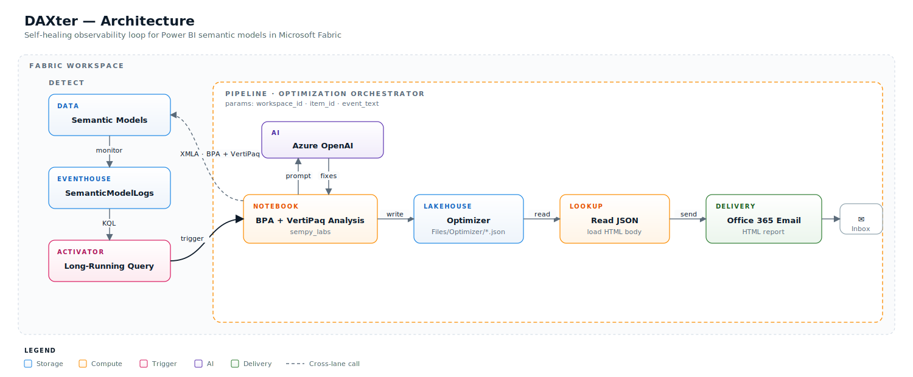
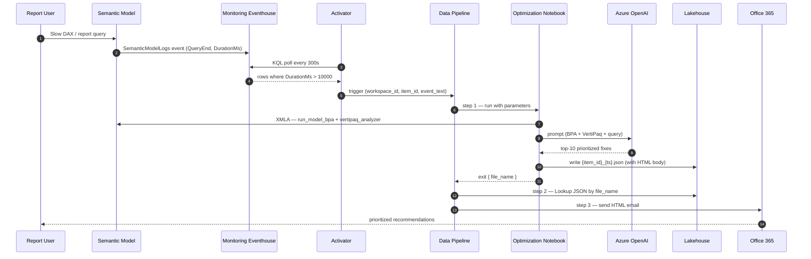

# Semantic Model Optimization Recommendation Pipeline

This project is an observability loop for Microsoft Fabric Power BI semantic models. When a query in your tenant takes too long, an Activator catches it, hands the context to an LLM-powered notebook that runs **Best Practice Analyzer** + **VertiPaq Analyzer**, and emails you a prioritized, query-specific optimization plan — all within minutes.

### Disclaimer

This repo is being provided for demo purposes only.  

Before using this code:

Thoroughly review and understand every cell before executing.
Test in a non-production environment first.
Ensure you have appropriate administrator permissions and organizational approval.
Back up any critical semantic models and workspace configurations.
Consider hard-coding a single workspace id for testing purposes.

The author(s) and Microsoft are not responsible for any data loss, service disruption, or unintended changes resulting from the use of this code. Use at your own risk.

This project does not represent the views or recommendations of Microsoft. It is a community contribution shared for educational and utility purposes.

---

## Architecture

**Three lanes:**

- **DETECT** — Semantic Models emit `SemanticModelLogs` into the Monitoring Eventhouse; an Activator polls a KQL query every 5 minutes for `QueryEnd` events with `DurationMs > 10000` and fires the optimization pipeline.
- **PIPELINE (orchestrator)** — A Data Pipeline runs three steps: (1) **Notebook** performs BPA + VertiPaq analysis and consults Azure OpenAI for ranked fixes; the result is persisted to the **Lakehouse**. (2) **Lookup** reads the JSON record. (3) **Email** delivers the HTML report.
- **CROSS-LANE** — The notebook reaches back to the Semantic Models via XMLA (BPA + VertiPaq); the Activator triggers the pipeline; the pipeline drops the final report into the engineer's inbox.

### End-to-end sequence

---

## Components

### 1. Activator (Reflex)

| Object | Detail |
|---|---|
| **Type** | Reflex / Activator |
| **KQL source** | Monitoring Eventhouse event — runs every **300 s** |
| **Eventhouse** | Monitoring KQL database (`SemanticModelLogs`) |
| **Query** | `SemanticModelLogs \| project Timestamp, DurationMs, OperationName, ItemId, ItemName, WorkspaceId, WorkspaceName, Status, ExecutingUser, EventText \| where DurationMs > 10000 and OperationName == 'QueryEnd' and Timestamp >= ago(5m)` |
| **Rule** | Long Running Queries — `OnEveryValue` trigger |
| **Action** | `FabricItemAction` → invokes the optimization pipeline |
| **Parameters passed** | `workspace_id` ← `WorkspaceId`, `item_id` ← `ItemId`, `event_text` ← `EventText` (event field references) |

### 2. Data Pipeline (Orchestrator)

**Parameters:** `workspace_id` (string), `item_id` (string), `event_text` (string)

| # | Activity | Type | Depends on | What it does |
|---|---|---|---|---|
| 1 | Optimization Notebook | TridentNotebook | — | Runs the notebook, forwarding all three pipeline parameters |
| 2 | Lookup JSON | Lookup | activity 1 | Reads `Files/Optimizer/{notebook.exit.file_name}` from the Lakehouse |
| 3 | Office 365 Email | Office365Email | activity 2 | Emails the HTML body (`Lookup JSON.output.value[0].html`) to configured recipients |

### 3. Optimization Notebook

**Default lakehouse:** Your Lakehouse
**Environment:** Spark environment with the libraries listed below

| Step | Cell | Purpose |
|---|---|---|
| 1 | imports | `notebookutils`, `sempy_labs`, `openai`, `markdown` |
| 2 | parameters | `workspace_id`, `item_id`, `event_text` (overridden by pipeline) |
| 3 | AOAI client | Acquires `cognitiveservices.azure.com` token via `notebookutils.credentials`; connects to your Azure OpenAI endpoint |
| 4 | `ask_llm(system, user)` | Thin wrapper around `chat.completions.create` (temperature 0.2) |
| 5 | BPA | `labs.run_model_bpa(dataset=item_id, workspace=workspace_id, return_dataframe=True)` → filters to `Severity == ⚠️` |
| 6 | VertiPaq | `labs.vertipaq_analyzer(...)` → markdown tables for Tables / Columns / Relationships |
| 7 | LLM prompt | Senior-architect persona; returns top-10 prioritized fixes tied to the offending query + memory hot-spot notes |
| 8 | Persist | Writes `{item_id}_{timestamp}.json` to `/lakehouse/default/Files/Optimizer/` containing `{status, report_path, file_name, html}` (markdown → HTML via `markdown`, with inline Outlook-friendly CSS) |
| 9 | Exit | `notebookutils.notebook.exit(json.dumps({"file_name": file_name}))` |

---

## Prerequisites

### Fabric

- **Capacity:** F-SKU (or trial) backing your workspace(s).
- **Workspace Monitoring** enabled on the workspace(s) whose semantic models you want to watch — this is what populates `SemanticModelLogs` in the Monitoring Eventhouse.

### Items to provision

| Item | Type | Notes |
|---|---|---|
| Monitoring KQL database | KQLDatabase | Receives `SemanticModelLogs` via Workspace Monitoring |
| Activator (Reflex) | Reflex | Hosts the KQL source + rule + `FabricItemAction` |
| Lakehouse | Lakehouse | Stores `Files/Optimizer/*.json` reports |
| Data Pipeline | DataPipeline | Three-step orchestrator |
| Optimization Notebook | Notebook | Runs BPA + VertiPaq + LLM |
| Spark Environment | Environment | Bundles the Python libraries below |

### Azure OpenAI

- An Azure OpenAI resource with a deployed chat model (e.g., `gpt-4o-mini` or larger).
- The Fabric workspace identity (or the notebook executor) must have **`Cognitive Services OpenAI User`** on the AOAI resource — the notebook authenticates via `notebookutils.credentials.getToken("https://cognitiveservices.azure.com/.default")`.

### Connections

- **Office 365 Outlook** connection bound to a mailbox authorized to send the alert email.
- Lakehouse linked service configured in the pipeline with `rootFolder: Files`.

### Environment / libraries

The notebook expects these in its attached Spark environment:

- `sempy-labs` — `run_model_bpa`, `vertipaq_analyzer`
- `openai` (≥ 1.x, Azure support)
- `markdown` — with `tables`, `fenced_code`, `sane_lists`, `toc` extensions
- `tabulate` — transitive; required by `pandas.DataFrame.to_markdown`

## Tuning knobs

| Where | Knob | Default | Notes |
|---|---|---|---|
| Activator KQL source | `executionIntervalInSeconds` | `300` | Lower for faster reaction; higher to cut capacity cost |
| Activator KQL query | `DurationMs > 10000` | 10 s | Raise to reduce noise; lower to catch more |
| Activator KQL query | `ago(5m)` window | 5 min | Should be ≥ poll interval to avoid gaps |
| Pipeline email activity | `to`, `subject` | hard-coded | Parameterize for multi-tenant routing |
| Notebook | `DEPLOYMENT` | your model | Swap for a larger model when fixes get repetitive |
| Notebook | `temperature` | `0.2` | Keep low for deterministic engineering advice |
| Notebook | `bpa["Severity"] == "⚠️"` | severe only | Drop the filter for full BPA coverage |

---

## Extending 

- **More signals** — add KQL sources for `OperationName == 'CommandEnd'` (slow refreshes) or `Status != 'Succeeded'`.
- **Routing** — parameterize the pipeline to email the user that executed the query
- **Persistence** — write each LLM verdict into a Delta table for trend analysis (`Files/Optimizer/` → `Tables/optimization_history`).
- **Closed loop** — auto-open a Fabric Git PR with the suggested TMDL changes using `sempy_labs` model-editing APIs.
- **Output** - this iteration simply sends an email, but it could be modified to deliver a Teams message.

